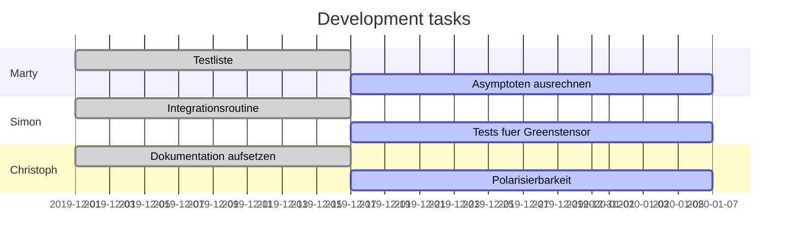

# Status
!> QuaCa is still under development.

?> For more recent updates, visit the developers. :100:

# Current tasks

# Ideas

* make an applet where the user enters systems parameters in unit of their choice (e.g. the height $z_a$ in nanometers) and gets a ready to use `.json` file with the right units for QuaCa
* assertions in ALL constructors to reflect right domain of parameters
