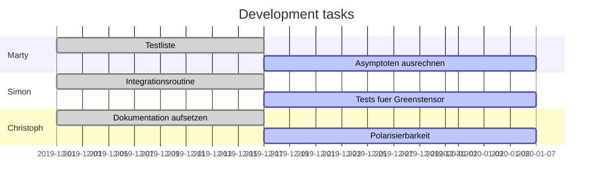

# Project structure

## Folder structure

The project is organized as follows:

```bash
    QuaCa/
    ├── app
    ├── bin
    ├── build
    ├── data
    ├── docs
    ├── include
    ├── lib
    ├── src
    └── test
```

The directory contains ...

- `app/`: source files for the executables
- `bin/`: the executables (binary files)
- `build/`: build files produced by cmake
- `data/`: various data files for the tests, tutorials and other applications
- `docs/`: the documentation
- `include/`: library headers
- `src/`: source files for the quaca library
- `test/`: unit tests

# Current tasks


